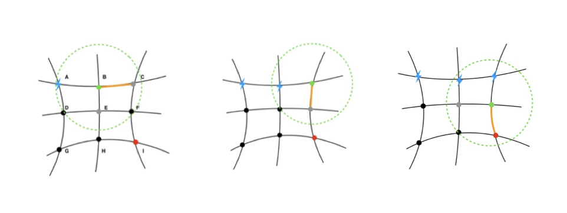
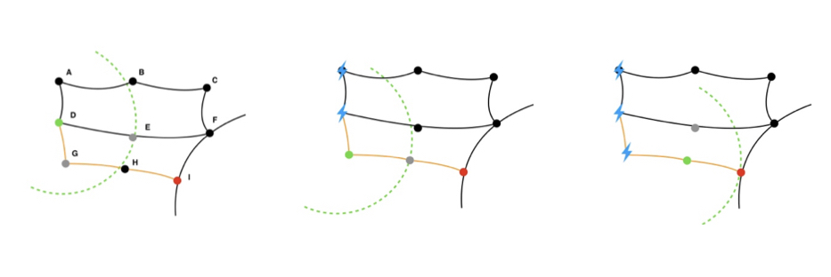
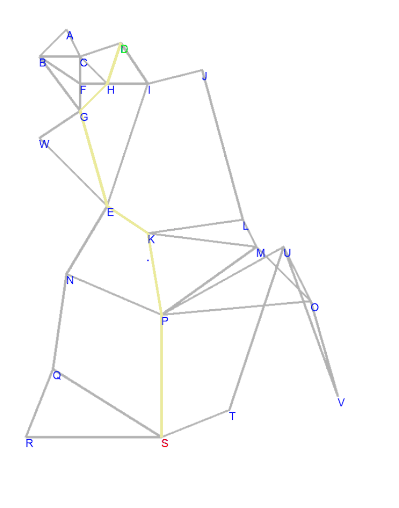
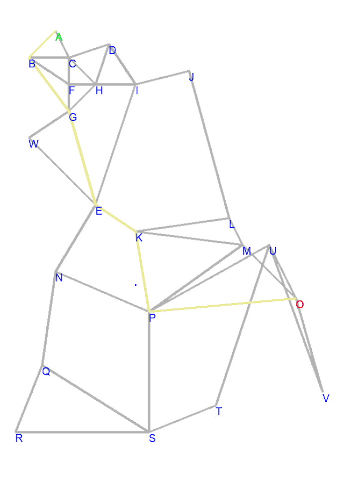
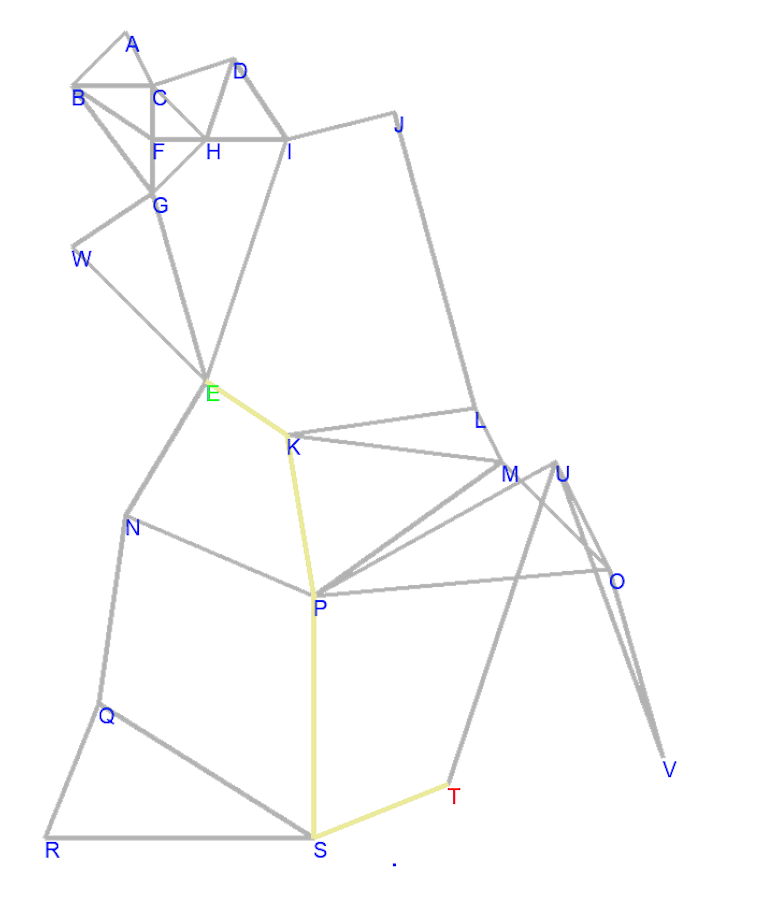
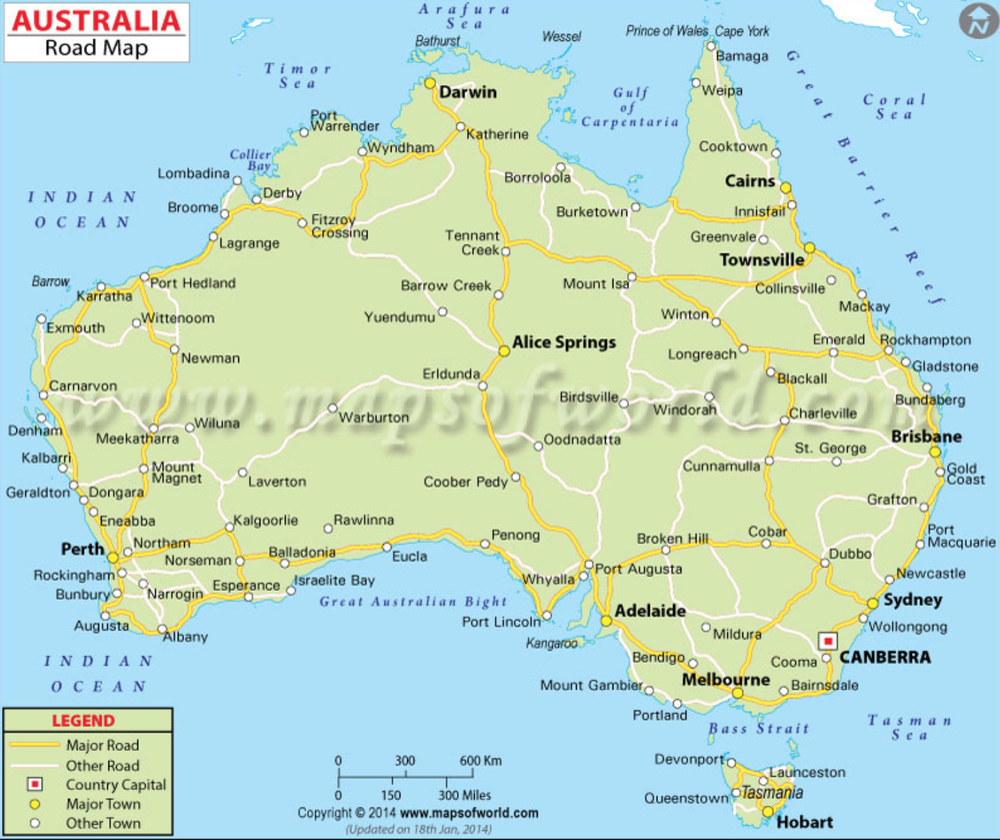
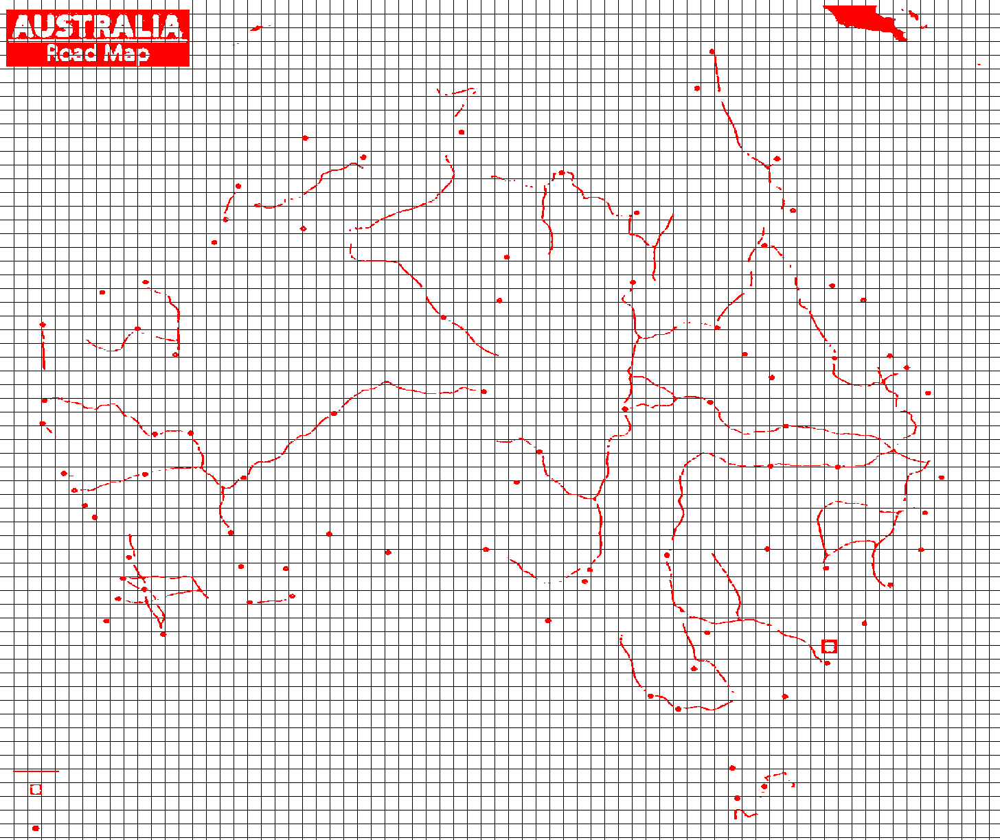

# 2018_MCM-ICM


<p align="center">
  
</p>


Time remains: 0 hours

#### Contributors: Pan, Johnson, Jenny


## Final result 

[2018 MCM/ICM TaskD paper](./2018mcmthesis.pdf)

## Model Introduction 

### Population Distribution Trail Model (PDT)
> PDT model is for chargers placement, so the current task is figuring out how 
cars move and decide the chargers. Start with a site, setting running capacity as radius, find the maximum
site it could reach, program ends when start equals end.


> Condition1, it could arrive at the destination firstly 

The path is AB, then place two chargers at start(A) and end site(B).


> Condition2, this condition aims at solving the cars can not arrive at the final destination firstly. 

car starts with A, so B is the next maximum site(NMS) with A's capacity, then place at A. Then start with B, NMS is C, 
place charger at B, so on... And place at final point.

### Shortest Route Preference model (SRP)



Find the shortest path first, and then set the chargers every capacity

## Funny programs 

### Visulizaition of dijkastra algorithm 
The detail file in the [draw_shortest_path](/tesla_statistic/road_simulation/plot.py), here just introduce how it works 

```
draw_charge_station(start, end, scale=25, size=1500, real_road=real_road)`
```

for example: 

```
draw_charge_station("D", "S")
draw_charge_station("B", "O")
draw_charge_station("E", "T")
```

|D-S|B-O|E-T|
|:---:|:---:|:----:|
||||

Note this map is extentable, which means if you have coordinates of all points and neighbors of every 
point, it can visulize any shortest path between. The data structure is in [this](tesla_statistic/road_simulation/config.py)

### Read city and road From a real map 

One thing disturbs us is reconstructing of the map, cause we need to run simulation in the 
real map. Here is a real road map of Australia. The detail program is in the [recognizatin_city_road](tesla_statistic/au_map_aly.py)

If we have a real map from google map or other sources like this.


Just run this file, then we can get the projection point with this 


The trick is pixels of road and cities are all white, whose RGB close to (255, 255, 255), then find these pixels in
this image, get the white pixel, add to new canvas. In this way, finding the coordinates of cities is very esay. 


