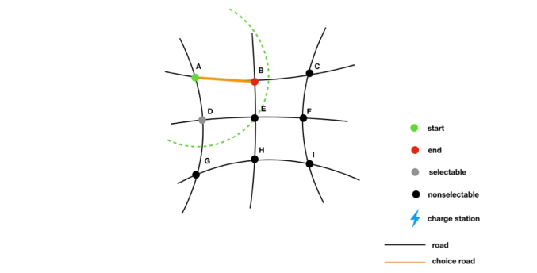

# 2018_MCM-ICM

  

Time remains: 0 hours

#### Contributors: Pan, Johnson, Jenny

## Final result 

[2018 MCM/ICM TaskD paper](./2018mcmthesis.pdf)

## Model Introduction 

### Population Distribution Trail Model (PDT)
> Start with a site, setting running capacity as radius, find the maximum
site it could reach, program ends when start equals end 

